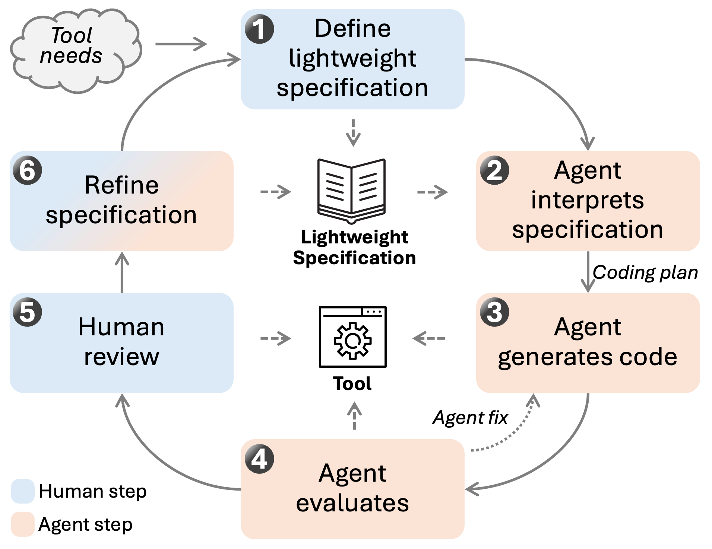

# Lightweight Specification-driven Development

  

This repository contains the lightweight specifications, prompts, and example implementations used in the study:

**"Leveraging Lightweight Specifications and Coding Agents to Develop Software Tools for Biomedical Data Analysis Workflows."**

---

## Overview

Biomedical data analysis often requires small, task-specific software tools.  
In this work, we explore a **lightweight specification–driven development workflow**, where structured textual specifications guide coding agents to generate research tools.

Instead of writing traditional source code from scratch, researchers describe:

- system purpose  
- functional requirements  
- data structures  
- implementation constraints  
- user interface design  

These specifications are then used by coding agents to generate software implementations.

---

## Lightweight Specifications

Here's some example lightweight specifications for demonstration purpose. The generated code is what Claude Code with Opus 4.6 generated. Based on our testings, usually the inital run may generate a workable version, but still more efforts are needed to ensure the tools are user-friendly or meet all task requirements. Please use with caution and make changes according to your own tasks.

According to our experience, you can write in any language to describe your task. The format does not really matter; it is mainly for ourselves to review and reference.

- [OMOP Patient Viewer](./specifications/omop-patient-viewer.md), [generated code](https://github.com/BIDS-Xu-Lab/omop-patient-viewer). A TUI-based tool for viewing OMOP format patient data in CSV files.
- [Text Annotation Concept Mapping](./specifications/text-annotation-concept-mapping-tool.md), [generated code](https://github.com/BIDS-Xu-Lab/blu-lite). A tool for mapping concepts and text annotation.
- [Document Labeling Tool](./specifications/quick-annotation-with-db.md), [source code](https://github.com/Flowerfan/annotation_web). A tool for helping quick document annotation.
- [Text Embedding Pipeline](./specifications/text-embedding-pipeline.md), [generated code](https://github.com/BIDS-Xu-Lab/simple-text-embedding-pipeline). A script tool for generating text embeddings.
- [COVID19 Data Index](./specifications/covid19-data-index.md), [generated code](https://github.com/BIDS-Xu-Lab/covid19-data-index). This is an old example with iterative refinement. The website is available at https://www.covid19dataindex.org/

# How to Use?

## How to Use the Lightweight Specifications

The lightweight specifications provided in this repository are designed to guide coding agents in generating software tools.

A typical workflow is as follows:

### Step 1. Select or create a specification
Each specification is written as a structured text document describing the target tool, including:

- system purpose  
- functional requirements  
- data structures  
- implementation constraints  
- user interface design (if applicable)

Users can start from an existing specification in the `specifications/` directory or create a new one by modifying an existing example.

---

### Step 2. Provide the specification to a coding agent

The specification can be provided directly to a coding agent such as:

- [Claude Code](https://claude.com/product/claude-code)
- [Codex](https://developers.openai.com/codex/app/)
- other LLM-based coding assistants

The specification serves as the main instruction guiding the generation of the software implementation.

---

### Step 3. Generate an initial implementation

The coding agent generates an initial version of the software tool based on the specification.

This may include:

- application code
- data processing scripts
- usage
---

### Step 4. Review and validate the generated tool

Human review remains essential.  
Users should verify that the generated software behaves correctly when applied to real datasets and satisfies the intended research requirements.

---

### Step 5. Iteratively refine the specification

Instead of modifying the generated source code directly, users refine the specification to clarify requirements or adjust functionality. It would be great to merge your refined specs to the original version, or you can ask agent to merge.

The coding agent then regenerates or updates the implementation based on the updated specification.

---

This workflow allows researchers to rapidly develop task-specific tools while keeping the development process centered on structured specifications rather than manual programming.
